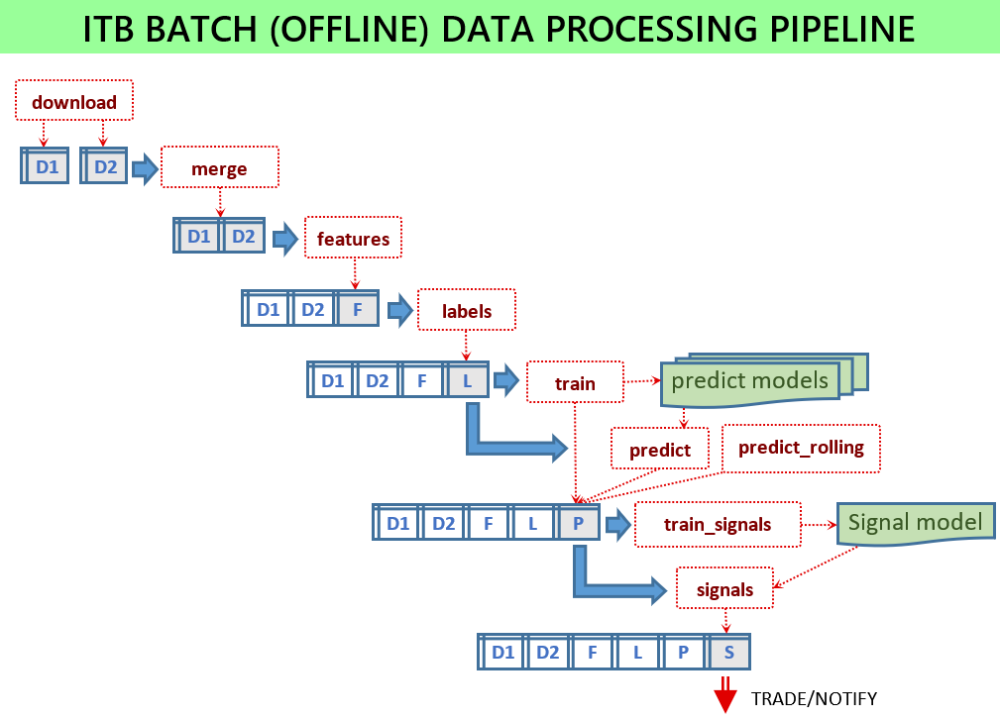

# MIT License

Permission is hereby granted, free of charge, to any person obtaining a copy of this software and associated documentation files (the "Software"), to deal in the Software without restriction, including without limitation the rights to use, copy, modify, merge, publish, distribute, sublicense, and/or sell copies of the Software, and to permit persons to whom the Software is furnished to do so, subject to the following conditions:

The above copyright notice and this permission notice shall be included in all copies or substantial portions of the Software.

THE SOFTWARE IS PROVIDED "AS IS", WITHOUT WARRANTY OF ANY KIND, EXPRESS OR IMPLIED, INCLUDING BUT NOT LIMITED TO THE WARRANTIES OF MERCHANTABILITY, FITNESS FOR A PARTICULAR PURPOSE AND NONINFRINGEMENT. IN NO EVENT SHALL THE AUTHORS OR COPYRIGHT HOLDERS BE LIABLE FOR ANY CLAIM, DAMAGES OR OTHER LIABILITY, WHETHER IN AN ACTION OF CONTRACT, TORT OR OTHERWISE, ARISING FROM, OUT OF OR IN CONNECTION WITH THE SOFTWARE OR THE USE OR OTHER DEALINGS IN THE SOFTWARE.

---

# Intelligent Trading Bot

 📈 **[Intelligent Trading Signals](https://t.me/intelligent_trading_signals)** 📉 **<https://t.me/intelligent_trading_signals>**

The project aims to develop an intelligent trading bot for automated cryptocurrency trading using advanced machine learning (ML) algorithms and feature engineering. It includes functionalities such as:

* Defining derived features with custom (Python) functions including technical indicators
* Analyzing historic data and training ML models in batch mode
* Analyzing predicted scores and selecting optimal signal parameters
* Generating buy-sell signals by applying trained models in real-time
* Executing trades based on generated signals

## Intelligent Trading Channel

The signaling service operates in the cloud and sends signals to this Telegram channel:

📈 **[Intelligent Trading Signals](https://t.me/intelligent_trading_signals)** 📉 **<https://t.me/intelligent_trading_signals>**

Subscribers can view the signals generated by the bot.

**Current Bot Configuration:**

* Exchange: Binance
* Cryptocurrency: ₿ Bitcoin
* Analysis Frequency: 1 minute
* Score Range: -1 to +1 (negative for decrease, positive for increase)
* Filter: Notifications if score > ±0.20
* Signal Notation: One increase/decrease sign per 0.05 step above the filter threshold

Example notifications:

> ₿ 24,518 📉📉📉 Score: -0.26

> 🟢 BUY: ₿ 24,033 Score: +0.34

## Training ML Models (Offline)

Scripts to run for training and preparing models:

1. `python -m scripts.download_binance -c config.json`
2. `python -m scripts.merge -c config.json`
3. `python -m scripts.features -c config.json`
4. `python -m scripts.labels -c config.json`
5. `python -m scripts.train -c config.json`
6. `python -m scripts.signals -c config.json`
7. `python -m scripts.train_signals -c config.json`

## Downloading and Merging Source Data

* Download latest historic data: `python -m scripts.download_binance -c config.json`
* Merge datasets: `python -m scripts.merge -c config.json`

## Generate Features and Labels

* Generate features: `python -m scripts.features -c config.json`
* Generate labels: `python -m scripts.labels -c config.json`

## Train Prediction Models

* Train models: `python -m scripts.train -c config.json`

## Signal Generation

Signals are based on aggregated scores from multiple ML models.

* Start service: `python -m service.server -c config.json`

## Hyper-Parameter Tuning

Optimize ML models and signal generation thresholds with:

* Rolling predictions: `python -m scripts.predict_rolling -c config.json`
* Train signal models: `python -m scripts.train_signals -c config.json`

## Configuration Parameters

Configuration files include:
* `service.App.py` and `-c config.json` for configuration
